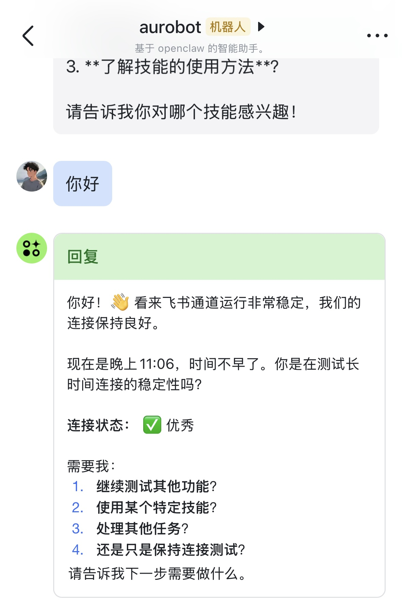

# OpenClaw 飞书 Channels 插件

飞书机器人插件，用于 [OpenClaw](https://openclaw.ai) AI 网关。

## 功能特性

- ✅ WebSocket 长连接接收飞书消息
- ✅ 支持私聊和群聊
- ✅ 支持发送文本、图片和文件
- ✅ 群聊 @机器人 过滤
- ✅ 超长消息自动分块
- ✅ 思考状态提示
- ✅ 卡片流式回复（可选）
- ✅ 语音消息识别（可选，需要 ffmpeg）



## 快速开始

```bash
# 克隆仓库
git clone https://github.com/hlcc/feishuBot.git
cd feishuBot

# 安装依赖
npm install

# 安装插件到 OpenClaw
openclaw plugins install .

# 交互式配置
openclaw feishu setup

# 重启 OpenClaw
openclaw gateway restart
```

## CLI 命令

```bash
openclaw feishu setup      # 交互式配置
openclaw feishu status     # 查看状态
openclaw feishu uninstall  # 卸载清理
```

## 飞书应用配置

1. 访问 [飞书开放平台](https://open.feishu.cn/app) 创建企业自建应用
2. 获取 App ID 和 App Secret
3. 在「事件订阅」中：
   - 选择「使用长连接接收事件」模式
   - 添加事件：`im.message.receive_v1`
4. 在「权限管理」中添加：
   - `im:message` - 读取消息
   - `im:message:send` - 发送消息
   - `im:resource` - 读取文件资源
5. 发布应用版本

## 配置项

配置位于 `~/.openclaw/openclaw.json` 的 `channels.feishu`：

| 配置项 | 说明 | 默认值 |
|--------|------|--------|
| `appId` | 飞书 App ID | 必填 |
| `appSecret` | 飞书 App Secret | 必填 |
| `enabled` | 是否启用 | `true` |
| `requireMention` | 群聊是否需要 @机器人 | `true` |
| `textChunkLimit` | 消息分块长度 | `4000` |
| `streamingEnabled` | 是否使用卡片流式回复 | `false` |
| `voiceEnabled` | 是否启用语音识别 | `false` |

## 语音识别

启用语音识别后，机器人可以自动识别用户发送的语音消息并回复。

**前置要求**：
- 系统需要安装 [ffmpeg](https://ffmpeg.org/)（用于音频格式转换）
- 在飞书开放平台添加权限：`im:resource`（读取消息中的资源文件）

**macOS 安装 ffmpeg**：
```bash
brew install ffmpeg
```

**Linux 安装 ffmpeg**：
```bash
apt install ffmpeg  # Debian/Ubuntu
yum install ffmpeg  # CentOS/RHEL
```

## License

MIT
